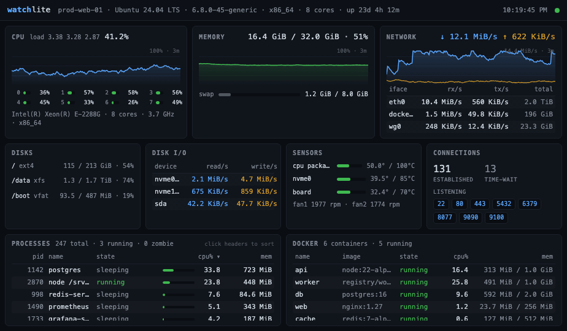

# watchlite

[](https://github.com/atrastudhi/watchlite/actions/workflows/ci.yml)
[](https://crates.io/crates/watchlite)
[](LICENSE)

An ultra-lightweight, single-binary server monitor with an embedded web dashboard — everything you need to glance at a box's health, in a binary smaller than a favicon.



- **Single static binary under 1 MB**, ~11 MB RSS, ~0.1% CPU — no runtime, no dependencies, nothing to install
- **Embedded web dashboard** (vanilla HTML/CSS/JS, dark htop-style theme) served by the binary itself
- **Metrics**: CPU (model, total + per-core), memory/swap, load average, disk usage + I/O rates, network throughput, temperatures + fans, TCP connections + listening ports, full sortable process list with states, Docker/Podman containers
- **History**: ring buffer (1h default) served at `/api/history` — charts survive page reloads *and* process restarts (saved to a small state file once a minute)
- **Alerts**: `--alert cpu>90` style thresholds with hysteresis; events log to stderr and optionally POST to a webhook
- **Prometheus**: `/metrics` endpoint in text exposition format — drop-in Grafana/Prometheus integration
- Container stats via the engine's unix socket with a hand-rolled client — Docker and Podman sockets are probed automatically (`--container-socket` overrides; rootless Podman needs `systemctl --user enable --now podman.socket`), gracefully hidden when no engine is present

## Supported platforms

| Platform | Binary | Notes |
|---|---|---|
| Linux x86_64 / arm64 | ✅ static (musl — works on any distro, glibc or not) | Full feature set |
| macOS arm64 / x86_64 | ✅ | No disk I/O, TCP connections, or fan panels (they read Linux `/proc`//`hwmon`); temperatures work |
| Windows | ❌ | Not supported — relies on unix sockets and `/proc` |
| FreeBSD & others | untested | May build via `cargo install`; Linux-only panels stay hidden |

## Install

Prebuilt static binaries come from [Releases](https://github.com/atrastudhi/watchlite/releases) — no runtime, no package manager.

**Linux** (x86_64 or arm64):

```sh
curl -fsSL "https://github.com/atrastudhi/watchlite/releases/latest/download/watchlite-$(uname -m)-unknown-linux-musl" \
  -o /usr/local/bin/watchlite && chmod +x /usr/local/bin/watchlite
```

**macOS** (Apple Silicon or Intel):

```sh
curl -fsSL "https://github.com/atrastudhi/watchlite/releases/latest/download/watchlite-$(uname -m | sed 's/arm64/aarch64/')-apple-darwin" \
  -o /usr/local/bin/watchlite && chmod +x /usr/local/bin/watchlite
```

**Any OS with a Rust toolchain** (1.95+):

```sh
cargo install watchlite
```

**Docker** (multi-arch, <1 MB image):

```sh
docker run -d --name watchlite --pid=host --net=host --uts=host \
  -v /var/run/docker.sock:/var/run/docker.sock:ro \
  ghcr.io/atrastudhi/watchlite:latest
```

The host namespaces are what let it report the host's processes, interfaces, connections, and hostname instead of the container's (the same flags Glances and netdata require); drop them (and add `-p 8077:8077`) if you only want a demo. With `--net=host` it binds `0.0.0.0:8077` by default — add `--auth user:pass` or bind to localhost behind a proxy.

The native binary needs none of this — it's static, smaller than the image, and sees everything by default. Prefer it unless your infra is containers-only.

## Usage

```sh
watchlite                                  # serves http://127.0.0.1:8077
watchlite --bind 0.0.0.0:8077 --auth admin:secret   # remote access with basic auth
```

| Flag | Default | Description |
|---|---|---|
| `--bind <ADDR>` | `127.0.0.1:8077` | Listen address (`0.0.0.0:...` for remote access) |
| `--interval <SECS>` | `2` | Sampling interval (0.5–3600) |
| `--top <N>` | `0` (all) | Cap the process list sent to the UI (0–10000) |
| `--no-docker` | | Disable the container collector |
| `--container-socket <P>` | auto | Engine socket; probes Docker then Podman (rootful, rootless) paths |
| `--auth <USER:PASS>` | | Require HTTP Basic auth |
| `--history <SECS>` | `3600` | Sample history kept in RAM (60–86400) |
| `--history-file <P>` | state dir | Persist chart history across restarts (`none` disables); defaults to systemd's `$STATE_DIRECTORY` or `~/.local/state/watchlite/` |
| `--alert <SPEC>` | | Alert rule, repeatable: `cpu>90`, `mem>85`, `disk>90` (percent; quote in shells) |
| `--webhook <URL>` | | POST alert events as JSON via `curl`; Discord webhook URLs are auto-detected and get a Discord-formatted message |
| `--once` | | Print one JSON snapshot to stdout and exit — for scripts: `watchlite --once \| jq .cpu.total_pct` |
| `--check-update` | | Check GitHub releases for a newer version and exit (exit 2 if one exists; never runs automatically) |

Env-var equivalents: `WATCHLITE_BIND`, `WATCHLITE_INTERVAL`, `WATCHLITE_TOP`, `WATCHLITE_AUTH`, `WATCHLITE_HISTORY`, `WATCHLITE_HISTORY_FILE`, `WATCHLITE_WEBHOOK`, `WATCHLITE_CONTAINER_SOCKET` (flags win).

## API

| Endpoint | Returns |
|---|---|
| `GET /api/stats` | Latest snapshot as JSON (one sample per interval; rates are bytes/sec from counter deltas) |
| `GET /api/history` | Ring buffer of compact points: `{ts, cpu, mem, rx, tx}` |
| `GET /metrics` | Prometheus text exposition format |
| `GET /healthz` | Liveness probe: `200 ok` (never requires auth) |

`disk_io` and `connections` are `null` on non-Linux hosts; `docker` is `null` when the Docker socket is unavailable; `sensors` is `null` when the host exposes none (typical for VMs). Fan speeds are Linux-only (`/sys/class/hwmon`).

Alerts fire after the threshold is exceeded for 3 consecutive samples and resolve the same way (no flapping). Webhook payload: `{"host", "metric", "value", "threshold", "state": "firing"|"resolved"}`.

## Build

```sh
cargo build --release          # native
```

Fully static Linux binary (deploy by copying one file):

```sh
docker run --rm -v "$PWD":/app -w /app rust:alpine \
  sh -c "apk add musl-dev && cargo build --release --target x86_64-unknown-linux-musl"
```

## Run as a service (systemd)

```ini
[Unit]
Description=watchlite
After=network.target

[Service]
ExecStart=/usr/local/bin/watchlite --bind 0.0.0.0:8077 --auth admin:CHANGE_ME
Restart=always
DynamicUser=yes
# persists chart history across restarts (/var/lib/watchlite)
StateDirectory=watchlite
# Docker panel needs socket access; remove if unused:
SupplementaryGroups=docker

[Install]
WantedBy=multi-user.target
```
